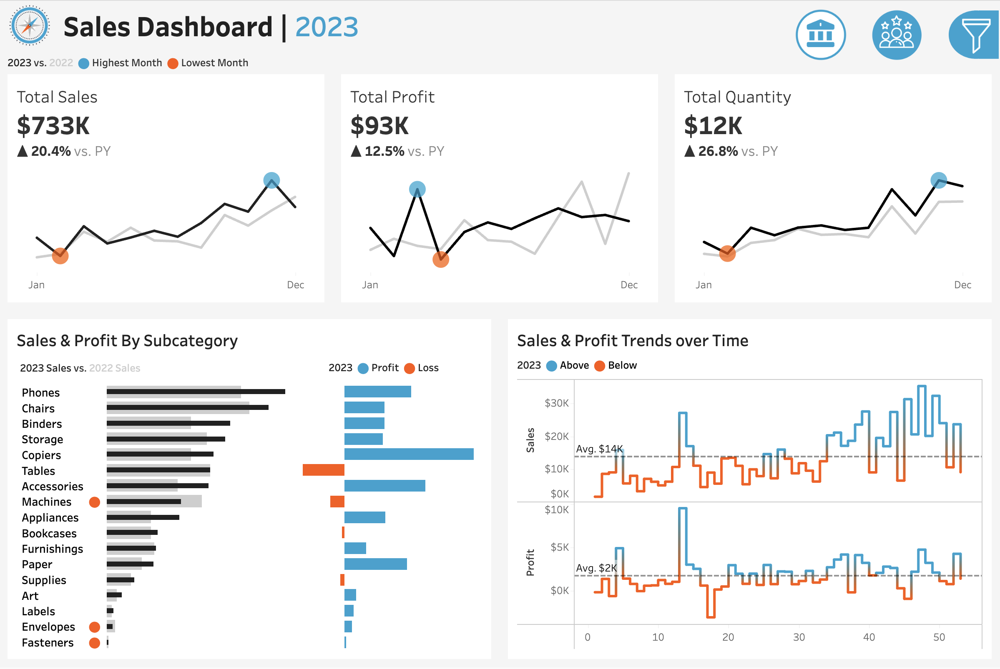
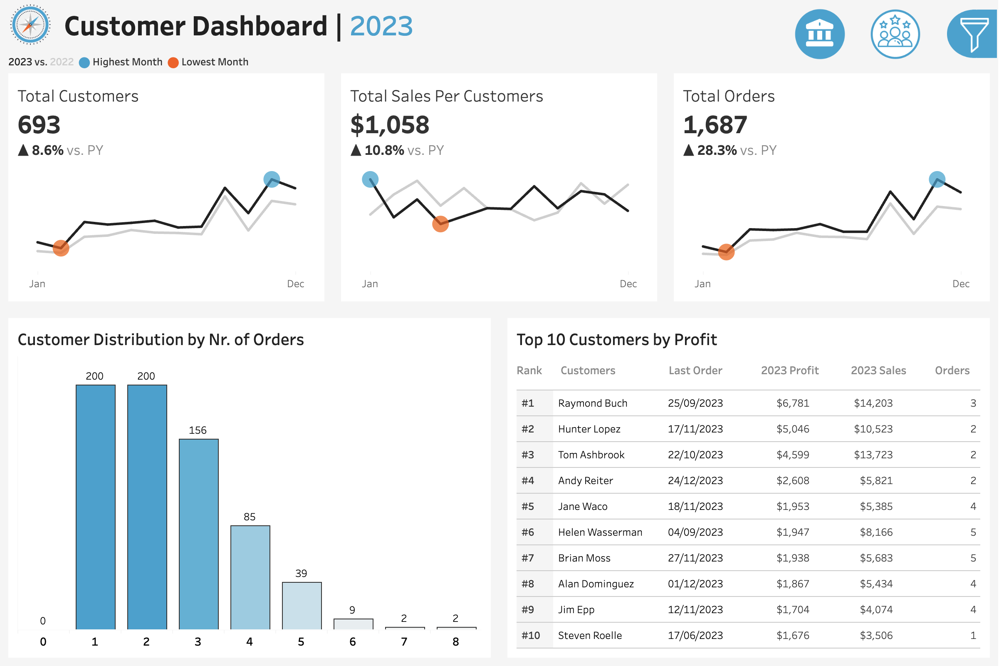

# Sales & Customer Dashboards

An interactive data visualization project built with Tableau to analyze sales performance and customer metrics.

## 📊 Live Dashboard
[View the Interactive Dashboard on Tableau Public](https://public.tableau.com/app/profile/nishant.ranjan.singh/viz/SalesCustomerDashboards_17772679446900/CustomerDashboard)

## 📸 Dashboard Previews

### Sales Dashboard

### Customer Dashboard

## 📁 Dataset
The data used for these dashboards is stored in the `dataset` directory and includes the following files:
- **Customers.csv:** Contains customer demographic and contact details.
- **Location.csv:** Geographical data related to the regions of sales.
- **Orders.csv:** Detailed transaction records of sales orders.
- **Products.csv:** Information about the various products sold.

## 🚀 How to View Locally
1. Download or clone this repository.
2. Ensure you have [Tableau Public](https://www.tableau.com/products/public) installed.
3. Open the `Sales & Customer Dashboards.twbx` file to interact with the dashboards.

## 🛠️ Built With
- **Tableau Public** - For data visualization and dashboard creation.
- **CSV Data Sources** - For the underlying dataset.
